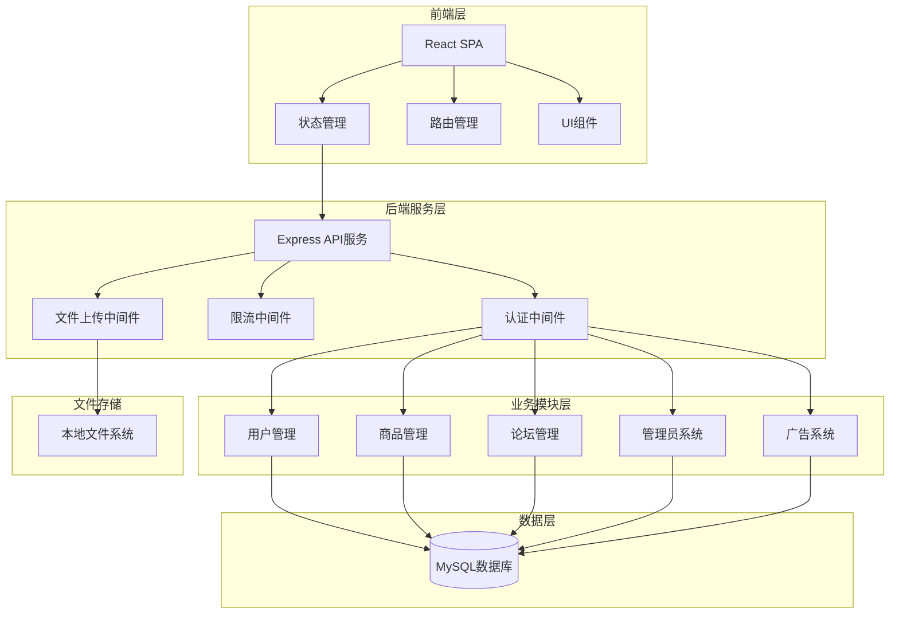

# 连理e站 技术概览

## 项目概述

### 项目定位
- **项目名称**: 连理e站 (LianliEStation)
- **项目类型**: 校园社区平台 - 集二手交易、论坛交流、信息发布于一体的综合性校园服务平台
- **核心价值**: 为大学生提供安全、便捷的校园生活服务，促进校园资源共享和信息交流
- **目标用户**: 高校在校学生，特别是大连理工大学(DUT)学生群体

### 业务功能模块
- **二手交易市场**: 商品发布、购买、交易管理
- **校园论坛**: 帖子发布、评论互动、社区交流
- **用户管理**: 注册登录、个人资料、收藏历史
- **管理员系统**: 用户管理、内容审核、数据统计
- **会员服务**: 会员等级、特权功能
- **广告系统**: 广告投放、点击统计
- **申诉系统**: 用户申诉、管理员处理

## 技术栈分析

### 前端技术栈
| 技术类型 | 技术选型 | 版本 | 用途 |
|---------|---------|------|------|
| 编程语言 | TypeScript | ES5+ | 主要开发语言 |
| 前端框架 | React | 18.2.0+ | 用户界面构建 |
| 状态管理 | Zustand | 5.0.3+ | 全局状态管理 |
| 路由管理 | React Router | 7.1.3+ | 单页面应用路由 |
| UI组件库 | Ant Design | 5.25.1+ | 企业级UI组件 |
| 样式预处理器 | Sass | 1.83.4+ | CSS预处理 |
| 构建工具 | React Scripts | 5.0.1+ | 项目构建和开发服务器 |
| HTTP客户端 | Axios | 1.7.9+ | API请求处理 |
| 图表库 | Chart.js | 4.5.0+ | 数据可视化 |

### 后端技术栈
| 技术类型 | 技术选型 | 版本 | 用途 |
|---------|---------|------|------|
| 编程语言 | JavaScript (ES6+) | Node.js | 服务器端开发 |
| Web框架 | Express | 4.16.1+ | HTTP服务框架 |
| 数据库 | MySQL | 8.0+ | 关系型数据存储 |
| 数据库驱动 | mysql2 | 3.12.0+ | MySQL连接池 |
| 身份认证 | JWT | 9.0.2+ | 用户身份验证 |
| 密码加密 | bcrypt | 5.1.1+ | 密码安全加密 |
| 文件上传 | multer | 1.4.5+ | 图片文件上传 |
| 邮件服务 | nodemailer | 6.10.0+ | 验证码发送 |
| 限流保护 | express-rate-limit | 7.5.0+ | API访问频率限制 |
| 定时任务 | node-cron | 4.2.1+ | 定时清理任务 |

### 开发工具和基础设施
| 技术领域 | 技术选型 | 作用 |
|---------|---------|------|
| 包管理 | npm | 依赖管理 |
| 开发环境 | Node.js | JavaScript运行时 |
| 热重载 | nodemon | 开发时自动重启 |
| 环境管理 | dotenv | 环境变量配置 |
| 代码规范 | ESLint | 代码质量检查 |
| 类型检查 | TypeScript | 静态类型检查 |

## 架构设计

### 系统架构图


### 分层架构
- **前端层**: React单页面应用，负责用户界面展示和交互
- **API网关层**: Express路由分发，中间件处理
- **业务服务层**: 用户服务、商品服务、论坛服务、管理服务
- **数据访问层**: MySQL数据库操作，文件存储管理
- **基础设施层**: 环境配置、日志记录、安全防护

### 项目组织结构
```
LianliEStation/
├── frontend/                 # 前端项目
│   ├── src/
│   │   ├── components/       # 公共组件
│   │   ├── pages/           # 页面组件
│   │   ├── store/           # 状态管理
│   │   ├── hooks/           # 自定义Hooks
│   │   ├── api/             # API接口
│   │   └── assets/          # 静态资源
│   ├── public/              # 公共文件
│   └── package.json         # 前端依赖配置
├── server/                  # 后端项目
│   ├── routes/              # 路由模块
│   │   ├── auth.js          # 认证路由
│   │   ├── goods.js         # 商品路由
│   │   ├── forum.js         # 论坛路由
│   │   ├── admin.js         # 管理路由
│   │   └── ...
│   ├── middlewares/         # 中间件
│   │   ├── authToken.js     # Token验证
│   │   ├── uploadImg.js     # 图片上传
│   │   ├── limiter.js       # 限流控制
│   │   └── ...
│   ├── db.js               # 数据库配置
│   └── app.js              # 应用入口
└── assets/                 # 项目资产
```

## 核心业务设计

### 用户体系设计
- **用户角色**: 普通用户、管理员
- **权限控制**: JWT Token认证，路由级权限控制
- **用户资料**: 昵称、头像、背景、信用积分
- **安全机制**: 密码加密、登录限流、IP记录

### 数据模型设计
- **用户表(users)**: 用户基本信息、认证信息
- **商品表(goods)**: 二手商品信息、交易状态
- **帖子表(posts)**: 论坛帖子内容、互动数据
- **收藏表(user_favorites)**: 用户收藏关系
- **申诉表(appeals)**: 用户申诉记录
- **广告表(advertisements)**: 广告投放管理
- **会员表(memberships)**: 会员服务管理

### 业务特性
- **响应式设计**: 支持PC和移动端适配
- **图片处理**: 支持图片上传、压缩、裁剪
- **搜索功能**: 关键词搜索、条件筛选
- **互动功能**: 点赞、收藏、评论、投诉
- **数据统计**: 访问记录、交易统计、用户行为分析

## 开发规范

### 代码规范
- **命名约定**: 驼峰命名法，组件使用PascalCase，变量使用camelCase
- **代码风格**: ESLint规范检查，Prettier代码格式化
- **类型安全**: TypeScript严格模式，接口定义完整
- **错误处理**: 统一错误处理机制，友好的用户提示
- **日志规范**: 结构化日志记录，错误信息追踪

### 工程实践
- **组件设计**: 函数式组件，Hooks状态管理
- **状态管理**: Zustand轻量级状态管理，持久化存储
- **API设计**: RESTful API规范，统一响应格式
- **文件组织**: 功能模块化，职责分离清晰
- **性能优化**: 懒加载、防抖、虚拟滚动

### 安全实践
- **身份认证**: JWT Token认证，Token过期机制
- **密码安全**: bcrypt加密存储，盐值处理
- **API防护**: 请求频率限制，IP黑名单
- **数据验证**: 输入参数校验，SQL注入防护
- **文件安全**: 文件类型检查，上传路径限制

## 快速开始

### 环境准备
- **Node.js**: 版本16.0.0+
- **MySQL**: 版本8.0+
- **开发工具**: VSCode、Git

### 前端启动
```bash
# 进入前端目录
cd frontend

# 安装依赖
npm install

# 启动开发服务器
npm start
```

### 后端启动
```bash
# 进入后端目录
cd server

# 安装依赖
npm install

# 配置环境变量
cp .env.example .env
# 编辑.env文件配置数据库连接

# 启动开发服务器
npm start
# 或使用nodemon热重载
npx nodemon app.js
```

### 数据库初始化
1. 创建MySQL数据库 `lianli`
2. 执行[server/README.md](server/README.md)中的SQL脚本创建表结构
3. 配置数据库连接信息在环境变量中

### 开发流程
1. 前端运行在 `http://localhost:3000`
2. 后端运行在 `http://localhost:5000`
3. 前后端通过API进行数据交互
4. 使用浏览器开发者工具进行调试

## 部署说明

### 生产环境要求
- **服务器**: Node.js运行环境
- **数据库**: MySQL数据库服务
- **文件存储**: 本地文件系统或云存储
- **反向代理**: Nginx配置（可选）

### 构建部署
```bash
# 前端构建
cd frontend && npm run build

# 后端部署
cd server && npm start
```

### 环境配置
生产环境需要配置以下环境变量：
- 数据库连接信息
- JWT密钥
- 邮件服务配置
- API密钥等敏感信息

## 项目特色

### 技术特色
- **现代化技术栈**: React + TypeScript + Express全栈开发
- **响应式设计**: 完美适配PC和移动端
- **状态管理**: 轻量级Zustand状态管理方案
- **组件化开发**: 高度可复用的组件设计
- **TypeScript**: 完整的类型定义，开发体验优秀

### 业务特色
- **校园场景**: 专门为高校学生设计的社区平台
- **信用体系**: 用户信用积分机制，保障交易安全
- **会员服务**: 分级会员体系，提供增值服务
- **内容审核**: 敏感词过滤，管理员审核机制
- **数据统计**: 完整的用户行为分析和业务统计

### 扩展性设计
- **模块化架构**: 各功能模块独立，便于扩展
- **API设计**: 标准的RESTful API接口
- **数据库设计**: 规范的数据表结构，支持业务扩展
- **中间件体系**: 可插拔的中间件设计