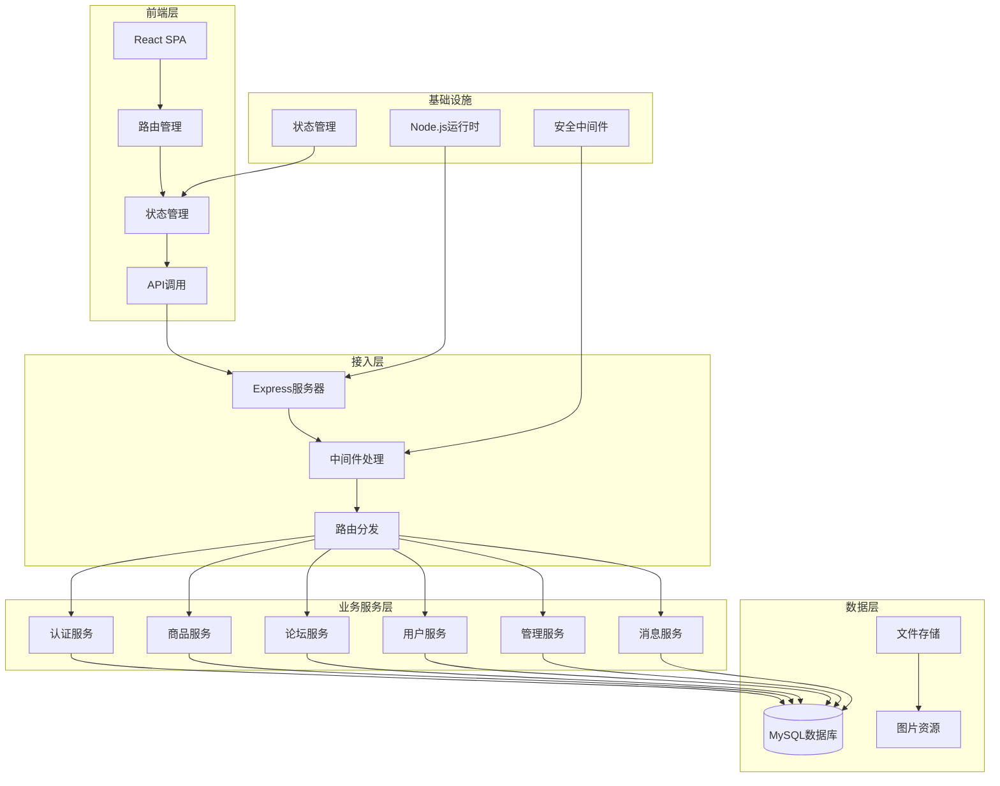
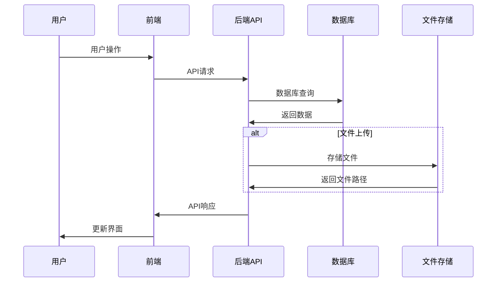

# 连理e站 整体架构分析

## 架构概览

### 系统定位
- **项目类型**: 校园社交电商平台
- **业务领域**: 高校二手交易、校园社交、信息发布
- **用户规模**: 高校学生群体，预计数千到数万用户
- **技术复杂度**: 中等复杂度，包含前后端分离、用户认证、数据管理等功能

### 架构目标
- **高性能**: 支持高并发访问，响应时间<100ms
- **高可用**: 通过负载均衡和容错机制保证服务可用性
- **可扩展**: 模块化设计支持功能扩展
- **易维护**: 清晰的代码结构和文档支持

## 系统架构设计

### 架构风格
#### 前后端分离架构
- **架构描述**: 采用React前端 + Express后端API的分离架构，前端负责UI展示和用户交互，后端提供RESTful API服务
- **选择原因**: 便于团队协作开发，前端可独立部署，支持多端复用API
- **适用场景**: 现代Web应用开发，需要良好用户体验和快速迭代

### 整体架构图

### 架构分层说明
#### 前端层
- **技术栈**: React 18 + TypeScript + Ant Design
- **状态管理**: Zustand状态管理库，分模块管理用户、商品、记录等状态
- **路由管理**: React Router DOM实现SPA路由
- **UI组件**: Ant Design组件库提供统一UI风格

#### 接入层
- **Web服务器**: Express.js框架提供HTTP服务
- **中间件**: 认证、限流、日志、CORS等中间件处理
- **静态资源**: 托管上传的图片等静态文件

#### 业务服务层
- **服务拆分**: 按功能模块划分路由，包括认证、商品、论坛、用户、管理等
- **服务治理**: 通过中间件实现统一的认证授权和限流控制
- **业务逻辑**: 各路由模块处理具体的业务逻辑

#### 数据层
- **数据存储**: MySQL关系型数据库存储结构化数据
- **文件存储**: 本地文件系统存储上传的图片资源
- **缓存策略**: 暂无集中缓存，依赖数据库查询优化

## 服务架构

### 模块化设计
#### 服务清单
| 服务模块 | 功能描述 | 技术栈 | 依赖服务 |
|---------|----------|-------|----------|
| 认证服务 | 用户注册、登录、JWT认证 | Express + JWT | MySQL |
| 商品服务 | 二手商品发布、浏览、交易 | Express + MySQL | 文件存储 |
| 论坛服务 | 校园墙帖子发布、互动 | Express + MySQL | 文件存储 |
| 用户服务 | 用户信息管理、个人中心 | Express + MySQL | - |
| 管理服务 | 后台管理、数据统计 | Express + MySQL | 所有业务模块 |
| 消息服务 | 站内消息、通知 | Express + MySQL | - |

#### 服务间通信
- **同步通信**: HTTP/REST API，JSON数据格式
- **通信协议**: HTTP/HTTPS标准协议
- **数据格式**: JSON格式进行数据交换

### 服务治理
#### 认证授权
- **JWT认证**: 基于JSON Web Token的用户身份认证
- **权限控制**: 基于角色的访问控制(RBAC)，区分普通用户和管理员
- **Token管理**: 前端Cookie存储，后端JWT验证

#### 安全防护
- **限流控制**: 针对注册、登录、验证码等接口的请求频率限制
- **IP记录**: 记录用户IP地址用于安全审计
- **输入验证**: 参数校验和SQL注入防护

## 数据架构

### 数据存储架构
#### 数据库选型
| 数据库类型 | 技术选型 | 用途 | 特点 |
|-----------|---------|------|------|
| 关系数据库 | MySQL | 所有业务数据存储 | ACID特性、事务支持 |
| 文件存储 | 本地文件系统 | 图片、文件存储 | 简单易用、直接访问 |

#### 数据模型设计
- **用户模型**: 用户基本信息、认证信息、个人设置
- **商品模型**: 二手商品信息、交易状态、图片资源
- **论坛模型**: 帖子内容、回复、点赞收藏关系
- **消息模型**: 站内消息、系统通知
- **管理模型**: 管理员操作、数据统计

### 数据流设计
#### 业务数据流

#### 状态管理流
- **前端状态**: Zustand状态库管理应用状态
- **数据持久化**: 部分状态通过持久化中间件保存到本地存储
- **状态同步**: API调用后更新本地状态

## 技术架构

### 技术栈架构
#### 前端技术栈
| 技术层级 | 技术选型 | 版本 | 作用 |
|---------|---------|------|------|
| 开发语言 | TypeScript | - | 类型安全的JavaScript |
| 框架 | React | 18.2.0 | 用户界面构建 |
| 状态管理 | Zustand | 5.0.3 | 应用状态管理 |
| UI组件 | Ant Design | 5.25.1 | 企业级UI组件 |
| 路由 | React Router DOM | 7.1.3 | 单页面应用路由 |
| HTTP客户端 | Axios | 1.7.9 | API请求处理 |
| 样式 | SCSS | 1.83.4 | CSS预处理器 |

#### 后端技术栈
| 技术层级 | 技术选型 | 版本 | 作用 |
|---------|---------|------|------|
| 运行时 | Node.js | - | JavaScript运行时 |
| 框架 | Express | 4.16.1 | Web应用框架 |
| 数据库 | MySQL2 | 3.12.0 | MySQL数据库驱动 |
| 认证 | JWT | 9.0.2 | 身份认证 |
| 安全 | bcrypt | 5.1.1 | 密码加密 |
| 文件上传 | Multer | 1.4.5 | 文件上传处理 |
| 限流 | express-rate-limit | 7.5.0 | API限流控制 |

#### 中间件技术栈
| 中间件类型 | 技术选型 | 用途 | 特点 |
|-----------|---------|------|------|
| 认证中间件 | 自定义JWT中间件 | 用户身份验证 | 基于Token的认证 |
| 限流中间件 | express-rate-limit | API访问频率控制 | 防止恶意请求 |
| 日志中间件 | Morgan | 请求日志记录 | 开发调试 |
| CORS中间件 | cors | 跨域资源共享 | 前后端分离支持 |

### 架构模式应用
#### 设计模式
- **分层架构**: 清晰的前后端分离，各层职责明确
- **模块化设计**: 按功能模块划分代码结构，便于维护
- **中间件模式**: 通过中间件链处理请求，实现横切关注点

#### 架构原则
- **单一职责**: 每个模块和组件只负责单一功能
- **依赖注入**: 通过模块导入实现依赖管理
- **接口隔离**: API接口设计遵循RESTful原则

## 部署架构

### 开发环境架构
#### 本地开发
- **前端**: Create React App开发服务器，热重载支持
- **后端**: Node.js + Express开发服务器
- **数据库**: 本地MySQL数据库
- **文件存储**: 本地文件系统

#### 开发工具
- **包管理**: npm包管理器
- **构建工具**: React Scripts构建工具链
- **类型检查**: TypeScript编译器
- **代码质量**: ESLint代码检查

### 部署策略
#### 构建部署
- **前端构建**: 通过`npm run build`生成静态文件
- **后端部署**: Node.js应用直接运行
- **数据库**: MySQL数据库服务
- **静态资源**: Express静态文件托管

## 安全架构

### 认证授权架构
#### 身份认证
- **JWT认证**: 基于JSON Web Token的无状态认证
- **密码加密**: bcrypt算法加密用户密码
- **会话管理**: Token存储在客户端Cookie中

#### 权限控制
- **RBAC模型**: 基于角色的访问控制，区分用户和管理员
- **接口权限**: 通过中间件验证用户权限
- **数据权限**: 用户只能操作自己的数据

### 安全防护架构
#### 应用安全
- **输入验证**: 请求参数校验和过滤
- **SQL注入防护**: 使用参数化查询防止SQL注入
- **XSS防护**: 前端输入转义和内容安全策略

#### 访问控制
- **API限流**: 针对敏感接口的请求频率限制
- **IP记录**: 记录用户访问IP用于安全审计
- **错误处理**: 统一的错误响应，避免信息泄露

## 性能架构

### 性能优化策略
#### 前端优化
- **代码分割**: React.lazy实现路由级代码分割
- **图片优化**: 图片压缩和懒加载
- **状态管理**: 局部状态更新，避免不必要的重渲染

#### 后端优化
- **数据库优化**: 合理的索引设计和查询优化
- **连接池**: MySQL连接池管理数据库连接
- **静态资源**: Express静态文件服务优化

### 扩展性设计
#### 水平扩展
- **服务扩展**: 无状态设计支持多实例部署
- **数据库扩展**: 支持读写分离和分库分表
- **文件存储**: 可扩展为云存储服务

#### 垂直扩展
- **硬件升级**: 支持服务器配置升级
- **缓存层**: 可引入Redis缓存提升性能
- **CDN加速**: 静态资源CDN分发

## 监控架构

### 日志监控
#### 应用日志
- **请求日志**: Morgan中间件记录HTTP请求
- **错误日志**: 统一错误处理记录异常信息
- **业务日志**: 关键业务操作日志记录

#### 性能监控
- **响应时间**: API接口响应时间监控
- **错误率**: 接口错误率统计
- **资源使用**: 服务器资源使用情况

### 开发监控
#### 开发工具
- **热重载**: 前端开发服务器热重载
- **类型检查**: TypeScript实时类型检查
- **代码提示**: IDE代码补全和错误提示

## 架构总结

连理e站采用现代前后端分离架构，具有以下特点：

1. **技术选型合理**: 使用React + TypeScript + Express技术栈，兼顾开发效率和性能
2. **架构清晰**: 分层架构设计，职责分离明确
3. **安全可靠**: 完善的认证授权和安全防护机制
4. **可扩展性强**: 模块化设计支持功能扩展和性能优化
5. **开发友好**: 完整的开发工具链和调试支持

该架构能够很好地支持校园社交电商平台的业务需求，并为后续的功能扩展和性能优化提供了良好的基础。