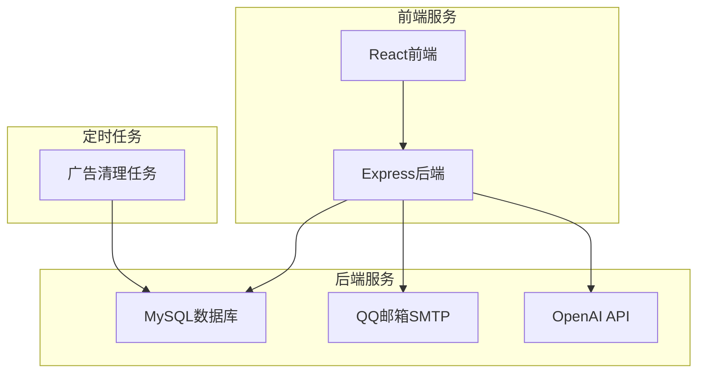
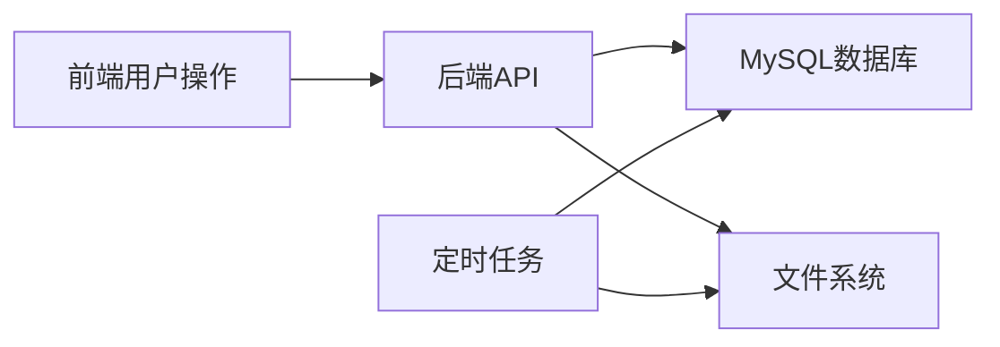

# 连理e站 服务依赖分析

## 依赖概览

### 服务清单
| 服务名称 | 端口 | 技术栈 | 责任人 | 状态 |
|---------|------|-------|--------|------|
| 前端服务 | 3000 | React+TypeScript | 前端团队 | ✅ 运行中 |
| 后端服务 | 5000 | Node.js+Express | 后端团队 | ✅ 运行中 |
| MySQL数据库 | 3306 | MySQL | 运维团队 | ✅ 运行中 |

### 依赖关系总览

## 服务间调用依赖

### HTTP服务调用
| 调用服务 | 被调用服务 | 接口路径 | 调用方式 | 依赖级别 |
|---------|-----------|----------|----------|----------|
| 前端服务 | 后端服务 | /api/auth/* | HTTP POST/GET | 强依赖 |
| 前端服务 | 后端服务 | /api/goods/* | HTTP GET/POST/PUT/DELETE | 强依赖 |
| 前端服务 | 后端服务 | /api/forum/* | HTTP GET/POST/PUT/DELETE | 强依赖 |
| 前端服务 | 后端服务 | /api/admin/* | HTTP GET/POST/PUT/DELETE | 强依赖 |
| 前端服务 | 后端服务 | /api/advertisements/* | HTTP GET/POST/PUT/DELETE | 强依赖 |
| 前端服务 | 后端服务 | /api/aiTemplate/* | HTTP POST | 强依赖 |
| 前端服务 | 后端服务 | /api/publish/* | HTTP POST | 强依赖 |
| 前端服务 | 后端服务 | /api/messages/* | HTTP GET | 强依赖 |
| 前端服务 | 后端服务 | /api/history/* | HTTP GET | 强依赖 |
| 前端服务 | 后端服务 | /api/favorites/* | HTTP GET/POST/DELETE | 强依赖 |

### 内部模块调用
| 调用模块 | 被调用模块 | 调用方式 | 依赖级别 |
|---------|-----------|----------|----------|
| admin路由 | aiTemplate模块 | 函数调用 | 弱依赖 |
| 定时任务 | 数据库模块 | 函数调用 | 强依赖 |

## 数据依赖分析

### 数据库依赖
| 服务名称 | 数据库 | 表名 | 操作类型 | 依赖级别 |
|---------|--------|------|----------|----------|
| 后端服务 | MySQL | users | CRUD | 强依赖 |
| 后端服务 | MySQL | goods | CRUD | 强依赖 |
| 后端服务 | MySQL | posts | CRUD | 强依赖 |
| 后端服务 | MySQL | advertisements | CRUD | 强依赖 |
| 后端服务 | MySQL | responses | CRUD | 强依赖 |
| 后端服务 | MySQL | record_event | CRUD | 强依赖 |
| 后端服务 | MySQL | response_images | CRUD | 强依赖 |
| 后端服务 | MySQL | appeals | CRUD | 强依赖 |
| 后端服务 | MySQL | favorites | CRUD | 强依赖 |
| 后端服务 | MySQL | history | CRUD | 强依赖 |

### 数据流依赖

## 配置依赖分析

### 环境配置依赖
#### 共享配置项
| 配置项 | 默认值 | 使用服务 | 描述 |
|--------|--------|----------|------|
| REACT_APP_API_URL | http://localhost:5000 | 前端服务 | API服务地址 |
| PORT | 5000 | 后端服务 | 服务端口 |
| DB_HOST | localhost | 后端服务 | 数据库主机 |
| DB_PORT | 3306 | 后端服务 | 数据库端口 |
| DB_USER | root | 后端服务 | 数据库用户 |
| DB_NAME | lianli | 后端服务 | 数据库名称 |
| SECRET_KEY | 无默认值 | 后端服务 | JWT密钥 |
| API_KEY | 无默认值 | 后端服务 | OpenAI API密钥 |
| EMAIL_USER | 无默认值 | 后端服务 | 邮箱账户 |
| EMAIL_PASS | 无默认值 | 后端服务 | 邮箱授权码 |

#### 服务特定配置
| 服务名称 | 配置项 | 默认值 | 描述 |
|---------|--------|--------|------|
| 前端服务 | REACT_APP_API_URL | http://localhost:5000 | API服务地址 |
| 后端服务 | PORT | 5000 | 服务端口 |
| 后端服务 | API请求超时 | 3000ms | API请求超时时间 |

## 接口依赖分析

### API接口依赖
| 调用服务 | 被调用服务 | 接口路径 | HTTP方法 | 依赖级别 |
|---------|-----------|----------|----------|----------|
| 前端服务 | 后端服务 | /api/auth/register | POST | 强依赖 |
| 前端服务 | 后端服务 | /api/auth/login | POST | 强依赖 |
| 前端服务 | 后端服务 | /api/goods | GET/POST/PUT/DELETE | 强依赖 |
| 前端服务 | 后端服务 | /api/forum/posts | GET/POST/PUT/DELETE | 强依赖 |
| 前端服务 | 后端服务 | /api/admin/* | 多种方法 | 强依赖 |
| 前端服务 | 后端服务 | /api/advertisements/* | 多种方法 | 强依赖 |
| 前端服务 | 后端服务 | /api/aiTemplate/check-sensitive | POST | 强依赖 |
| 前端服务 | 后端服务 | /api/aiTemplate/generate | POST | 强依赖 |
| 前端服务 | 后端服务 | /api/publish/template | POST | 强依赖 |

### 接口版本依赖
| 接口路径 | 版本 | 兼容性 | 升级策略 |
|----------|------|--------|----------|
| /api/* | v1 | 向后兼容 | 渐进式升级 |

## 第三方服务依赖

### 外部API依赖
#### AI服务依赖
| 服务名称 | AI服务 | API端点 | 用途 | 依赖级别 |
|---------|----------|----------|------|----------|
| 后端服务 | OpenAI | /v1/chat/completions | AI敏感词检测和模板生成 | 强依赖 |

#### 通信服务依赖
| 服务名称 | 服务类型 | API端点 | 用途 | 依赖级别 |
|---------|----------|----------|------|----------|
| 后端服务 | QQ邮箱SMTP | smtp.qq.com:465 | 邮件验证码发送 | 强依赖 |

### 云服务依赖
| 服务名称 | 云服务 | 服务类型 | 用途 | 依赖级别 |
|---------|--------|----------|------|----------|
| 后端服务 | 文件系统 | 本地存储 | 图片文件存储 | 强依赖 |

## 基础设施依赖

### 运行时依赖
#### Node.js依赖
| 服务名称 | Node.js版本 | 包管理器 | 依赖级别 |
|---------|------------|----------|----------|
| 前端服务 | 18.2.0+ | npm | 强依赖 |
| 后端服务 | ES模块 | npm | 强依赖 |

#### 数据库依赖
| 服务名称 | 数据库版本 | 连接池 | 依赖级别 |
|---------|------------|--------|----------|
| 后端服务 | MySQL 5.7+ | mysql2 | 强依赖 |

### 网络依赖
#### 跨域依赖
| 服务名称 | 跨域配置 | 允许域名 | 依赖级别 |
|---------|----------|----------|----------|
| 后端服务 | CORS中间件 | 前端域名 | 强依赖 |

## 定时任务依赖

### 定时任务列表
| 任务名称 | 执行频率 | 依赖服务 | 用途 | 依赖级别 |
|---------|----------|----------|------|----------|
| 广告清理任务 | 每天凌晨2点 | MySQL数据库、文件系统 | 清理过期广告 | 强依赖 |

## 总结

### 依赖关系总结
- **核心依赖**: MySQL数据库是所有数据操作的强依赖，数据库故障将导致整个系统不可用
- **外部服务依赖**: OpenAI API和QQ邮箱SMTP服务是关键的外部依赖，影响AI功能和邮件验证
- **前端-后端依赖**: 前端完全依赖后端API服务，后端服务不可用将导致前端功能失效
- **配置依赖**: 环境变量配置是系统正常运行的关键，缺少必要配置将导致服务启动失败

### 单点故障风险
1. **数据库单点故障**: 所有数据操作都依赖单一MySQL实例
2. **后端服务单点故障**: 前端所有功能都依赖单一后端服务实例
3. **外部API依赖**: OpenAI API和邮件服务故障将影响相关功能

### 依赖管理策略
1. **数据库**: 建议配置主从复制和定期备份
2. **后端服务**: 建议使用负载均衡和多实例部署
3. **外部API**: 建议实现降级策略和备用方案
4. **配置管理**: 建议使用配置中心管理敏感配置

### 监控方案
- 数据库连接状态监控
- 后端服务健康检查
- 外部API调用成功率监控
- 定时任务执行状态监控