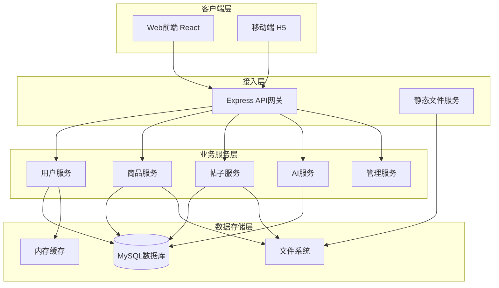
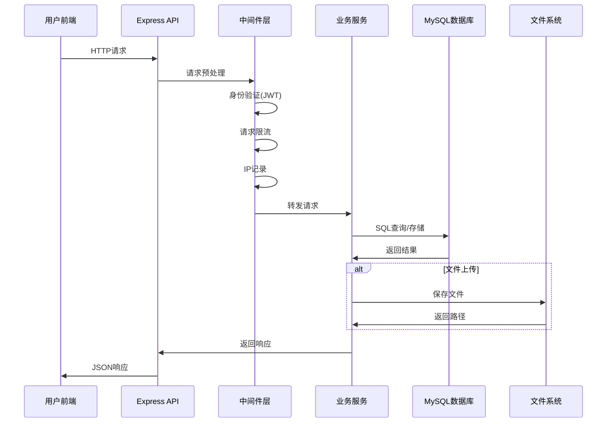

# 连理e站 数据流和集成分析

## 数据流概览

### 数据流分类
| 数据流类型 | 描述 | 涉及服务 | 传输方式 |
|-----------|------|----------|----------|
| 业务数据流 | 核心业务数据流转 | 前端React应用、后端Express服务 | HTTP/REST + JSON |
| 用户认证流 | 用户身份验证和授权 | 前端、后端auth模块 | JWT Token + Cookie |
| 文件数据流 | 图片上传和存储 | 前端、后端upload中间件 | FormData + 文件系统 |
| 事件数据流 | 系统事件记录和统计 | 后端服务、数据库 | 数据库直接写入 |
| 搜索数据流 | 搜索关键词统计 | 前端、后端搜索模块 | HTTP + 数据库异步记录 |

### 数据流架构图


## 业务数据流分析

### 核心数据流
#### 数据流转路径


#### 数据格式定义
**请求数据格式**:
```json
{
  "headers": {
    "Authorization": "Bearer {jwt_token}",
    "Content-Type": "application/json"
  },
  "body": {
    "field1": "value1",
    "field2": "value2"
  }
}
```

**响应数据格式**:
```json
{
  "status": "success",
  "data": {
    "result": "object"
  },
  "message": "操作成功",
  "timestamp": "2025-10-22T05:33:16.815Z"
}
```

## 集成模式分析

### API集成模式
| API端点 | HTTP方法 | 数据格式 | 用途 | 集成服务 |
|---------|----------|----------|------|----------|
| /api/auth/* | POST/GET | JSON | 用户认证 | 前端、后端auth模块 |
| /api/users/* | GET/PUT | JSON | 用户管理 | 前端用户设置、后端用户服务 |
| /api/goods/* | GET/POST/PUT/DELETE | JSON/FormData | 商品管理 | 前端商城、后端商品服务 |
| /api/forum/* | GET/POST/PUT/DELETE | JSON/FormData | 帖子管理 | 前端校园墙、后端帖子服务 |
| /api/publish/* | POST | FormData | 内容发布 | 前端发布页、后端发布服务 |
| /api/aiTemplate/* | POST | JSON | AI服务 | 前端AI功能、后端AI服务 |

### 文件集成模式
| 文件类型 | 存储方式 | 访问方式 | 用途 |
|----------|----------|----------|------|
| 用户头像 | 本地文件系统 | /uploads/{filename} | 用户资料展示 |
| 商品图片 | 本地文件系统 | /uploads/{filename} | 商品展示 |
| 帖子图片 | 本地文件系统 | /uploads/{filename} | 帖子内容展示 |
| 申诉图片 | 本地文件系统 | /uploads/{filename} | 申诉证据 |

### 数据库集成模式
| 数据库表 | 主要操作 | 数据一致性 | 用途 |
|----------|----------|------------|------|
| users | CRUD | 强一致性 | 用户信息管理 |
| goods | CRUD | 强一致性 | 商品信息管理 |
| posts | CRUD | 强一致性 | 帖子信息管理 |
| likes/complaints | 插入/删除 | 最终一致性 | 用户互动记录 |
| search_keywords | 插入/更新 | 最终一致性 | 搜索统计 |
| record_event | 插入 | 最终一致性 | 系统事件记录 |

## 数据一致性分析

### 事务一致性
#### ACID特性保证
- **原子性**: 数据库事务确保操作要么全部成功，要么全部失败
- **一致性**: 数据库约束（唯一索引、外键）保证数据一致性
- **隔离性**: MySQL默认隔离级别保证并发事务隔离
- **持久性**: 数据库持久化存储确保数据不丢失

#### 关键事务场景
```javascript
// 商品点赞事务示例
const connection = await db.getConnection();
await connection.beginTransaction();

try {
  // 1. 插入点赞记录
  await connection.query(
    `INSERT INTO likes (user_id, target_id, target_type) VALUES (?, ?, ?)`,
    [user_id, target_id, target_type]
  );
  
  // 2. 更新商品点赞数
  await connection.query(
    `UPDATE goods SET likes = likes + 1 WHERE id = ?`,
    [target_id]
  );
  
  await connection.commit();
} catch (error) {
  await connection.rollback();
  throw error;
}
```

### 最终一致性
#### 异步统计更新
- **搜索关键词统计**: 异步更新搜索次数，不影响主查询性能
- **事件记录**: 系统事件异步记录到record_event表
- **广告点击统计**: 点击次数异步更新

## 数据安全分析

### 数据加密
| 加密方式 | 加密算法 | 密钥长度 | 应用场景 |
|----------|----------|----------|----------|
| HTTPS | TLS 1.3 | 256位 | API通信加密 |
| 密码哈希 | bcrypt | - | 用户密码存储 |
| JWT签名 | HMAC SHA256 | 256位 | 身份令牌验证 |

### 数据脱敏
| 数据类型 | 脱敏方式 | 脱敏规则 | 应用场景 |
|----------|----------|----------|----------|
| 用户密码 | 不可逆哈希 | bcrypt哈希 | 数据库存储 |
| 邮箱 | 前端显示 | user***@domain.com | 公开显示 |
| 敏感内容 | AI检测 | 敏感词过滤 | 内容审核 |

### 访问控制
| 控制层级 | 控制方式 | 应用场景 |
|----------|----------|----------|
| 接口级别 | JWT Token验证 | 所有API接口 |
| 权限级别 | 角色验证 | 管理员功能 |
| 资源级别 | 所有者验证 | 用户只能操作自己的资源 |

## 数据监控和分析

### 数据流监控
| 指标类型 | 指标名称 | 监控方式 | 告警级别 |
|----------|----------|----------|----------|
| API性能 | 响应时间 | 中间件记录 | 警告(>1000ms) |
| API可用性 | 错误率 | 错误处理中间件 | 警告(>5%) |
| 用户行为 | 搜索关键词 | 数据库统计 | 分析用途 |
| 系统事件 | 业务操作 | record_event表 | 统计分析 |

### 数据分析维度
- **实时分析**: 用户活跃度、内容发布频率
- **批量分析**: 热门搜索词、用户行为模式
- **预测分析**: 基于历史数据的趋势预测
- **可视化分析**: 管理员后台数据展示

## 性能优化策略

### 缓存策略
| 数据类型 | 缓存方式 | 更新策略 | 应用场景 |
|----------|----------|----------|----------|
| 用户信息 | LocalStorage | 登录时更新 | 前端状态管理 |
| 商品列表 | 暂无缓存 | 实时查询 | 商城页面 |
| 帖子列表 | 暂无缓存 | 实时查询 | 校园墙页面 |
| 图片资源 | 浏览器缓存 | 缓存头控制 | 静态资源 |

### 数据库优化
| 优化策略 | 实现方式 | 效果 |
|----------|----------|------|
| 索引优化 | 关键字段索引 | 查询性能提升 |
| 分页查询 | LIMIT/OFFSET | 大数据量处理 |
| 连接池 | mysql2连接池 | 连接复用 |

### 前端优化
| 优化策略 | 实现方式 | 效果 |
|----------|----------|------|
| 请求合并 | Zustand状态管理 | 减少API调用 |
| 图片压缩 | 前端压缩上传 | 减少带宽 |
| 懒加载 | 分页加载 | 首屏优化 |

## 故障处理机制

### 错误处理
| 错误类型 | 处理方式 | 恢复策略 |
|----------|----------|----------|
| 网络错误 | 前端重试机制 | 自动重试3次 |
| 认证失败 | 跳转登录页 | 重新登录 |
| 服务器错误 | 错误页面展示 | 联系管理员 |
| 数据库错误 | 事务回滚 | 数据一致性保证 |

### 数据备份
| 备份类型 | 备份频率 | 恢复策略 |
|----------|----------|----------|
| 数据库备份 | 定期备份 | 数据恢复 |
| 文件备份 | 实时同步 | 文件恢复 |
| 配置备份 | 版本控制 | 配置恢复 |

## 总结

连理e站采用前后端分离架构，数据流设计遵循RESTful原则，通过JWT实现安全的身份验证，使用MySQL保证数据一致性。系统在数据安全、性能优化和故障处理方面都有相应的机制保障，能够满足校园社交平台的数据处理需求。

主要特点：
1. **分层架构**: 清晰的客户端-接入层-业务层-数据层分离
2. **安全可靠**: 完善的认证授权和数据加密机制
3. **性能优化**: 合理的缓存策略和数据库优化
4. **可扩展性**: 模块化设计便于功能扩展
5. **监控完善**: 全面的数据监控和分析能力