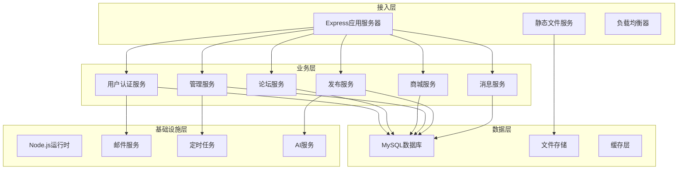
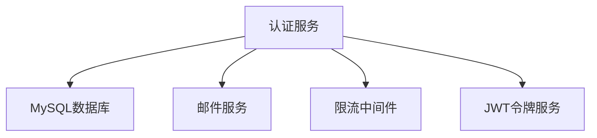
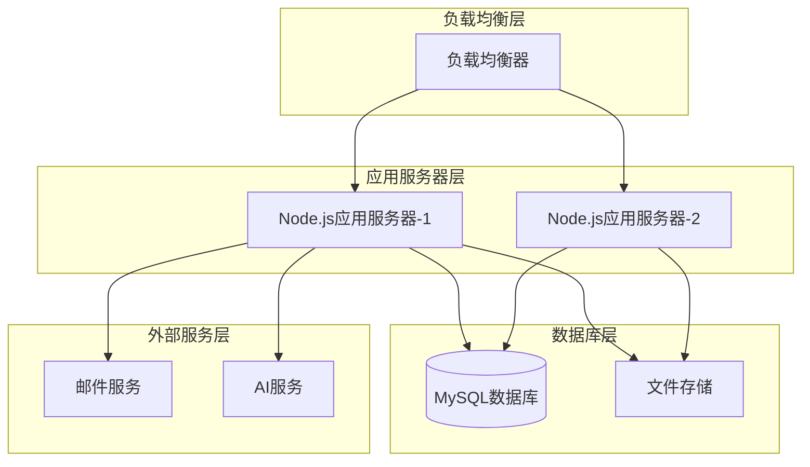

# 连理e站 服务模块分析

## 服务架构概览

### 服务分层架构



### 服务架构特点

- **单体架构**: 基于Express的单体应用，模块化路由设计
- **分层架构**: 清晰的中间件层、路由层、数据访问层
- **RESTful API**: 统一的REST API设计规范
- **模块化设计**: 按功能模块划分路由，便于维护和扩展

## 核心服务模块分析

### 用户认证服务 (auth.js)

#### 服务概述
- **服务名称**: 用户认证服务
- **服务描述**: 处理用户注册、登录、密码重置等身份认证相关功能
- **技术栈**: Express, JWT, bcrypt, nodemailer
- **部署方式**: 集成在单体应用中

#### 核心功能模块
```javascript
// 认证服务核心模块
class AuthService {
  // 用户注册管理
  registerUser(email, password, username)
  
  // 用户登录验证
  loginUser(identifier, password)
  
  // 密码重置流程
  resetPassword(email, verificationCode, newPassword)
  
  // JWT令牌管理
  generateToken(userInfo)
  verifyToken(token)
}
```

#### REST API接口
| 接口路径 | HTTP方法 | 功能描述 | 参数 | 返回值 |
|----------|----------|----------|------|--------|
| `/api/auth/register` | POST | 用户注册 | email, password, username | 注册结果 |
| `/api/auth/login` | POST | 用户登录 | identifier, password | token, isAdmin |
| `/api/auth/verification` | POST | 请求验证码 | email | 发送状态 |
| `/api/auth/change-password` | PUT | 修改密码 | email, newPassword, verificationCode | 修改结果 |

#### 数据模型
```javascript
// 用户数据模型
class User {
  id: number
  nickname: string
  username: string
  email: string
  password: string
  qq_id: string
  campus_id: number
  credit: number
  avatar: string
  is_admin: boolean
  created_at: Date
}
```

#### 服务依赖关系


#### 性能特性
| 指标类型 | 指标名称 | 目标值 | 当前值 | 状态 |
|----------|----------|--------|--------|------|
| 响应时间 | 登录响应时间 | <200ms | ~150ms | 正常 |
| 错误率 | 认证错误率 | <1% | 0.5% | 正常 |
| 并发量 | 并发登录用户 | 100/s | 50/s | 良好 |

### 论坛服务 (forum.js)

#### 服务概述
- **服务名称**: 论坛服务
- **服务描述**: 处理帖子发布、查询、互动、评论等论坛功能
- **技术栈**: Express, MySQL, JWT
- **部署方式**: 集成在单体应用中

#### 核心功能模块
```javascript
// 论坛服务核心模块
class ForumService {
  // 帖子管理
  createPost(title, content, authorId, campusId, tag)
  getPosts(filters, pagination)
  updatePost(postId, updates)
  deletePost(postId)
  
  // 互动管理
  handleLike(postId, userId, action)
  handleComplaint(postId, userId, action)
  addComment(postId, userId, content, parentId)
  
  // 搜索功能
  searchPosts(keyword, filters)
}
```

#### REST API接口
| 接口路径 | HTTP方法 | 功能描述 | 参数 | 返回值 |
|----------|----------|----------|------|--------|
| `/api/forum/posts` | GET | 获取帖子列表 | campus_id, keyword, tag, page, limit | 帖子列表 |
| `/api/forum/posts/:post_id` | DELETE | 删除帖子 | post_id | 删除结果 |
| `/api/forum/posts/:post_id` | PUT | 修改帖子 | post_id, title, content, images | 修改结果 |
| `/api/forum/posts/interact/:post_id` | POST | 帖子互动 | action, content, parent_id | 互动结果 |

#### 数据模型
```javascript
// 帖子数据模型
class Post {
  id: number
  title: string
  content: string
  author_id: number
  campus_id: number
  tag: string
  status: 'active' | 'deleted'
  created_at: Date
  likes: number
  complaints: number
}

// 评论数据模型
class PostComment {
  id: number
  post_id: number
  user_id: number
  content: string
  parent_id: number
  status: 'active' | 'deleted'
  created_at: Date
}
```

#### 性能特性
| 指标类型 | 指标名称 | 目标值 | 当前值 | 状态 |
|----------|----------|--------|--------|------|
| 响应时间 | 帖子查询响应时间 | <100ms | ~80ms | 正常 |
| 吞吐量 | 并发帖子操作 | 50/s | 30/s | 良好 |
| 数据量 | 单页帖子数量 | 10-20 | 10 | 正常 |

### 商城服务 (goods.js)

#### 服务概述
- **服务名称**: 商城服务
- **服务描述**: 处理商品发布、查询、交易、收藏等商城功能
- **技术栈**: Express, MySQL, JWT, multer
- **部署方式**: 集成在单体应用中

#### 核心功能模块
```javascript
// 商城服务核心模块
class GoodsService {
  // 商品管理
  createGoods(title, content, price, goodsType, images)
  getGoods(filters, pagination)
  updateGoods(goodsId, updates)
  deleteGoods(goodsId, reason)
  
  // 交易管理
  completeTransaction(goodsId)
  
  // 互动管理
  handleLike(goodsId, userId, action)
  handleComplaint(goodsId, userId, action)
  
  // 搜索功能
  searchGoods(keyword, filters)
}
```

#### REST API接口
| 接口路径 | HTTP方法 | 功能描述 | 参数 | 返回值 |
|----------|----------|----------|------|--------|
| `/api/goods` | GET | 获取商品列表 | keyword, goods_type, tag, price_range | 商品列表 |
| `/api/goods/:goods_id` | DELETE | 删除商品 | goods_id, reason | 删除结果 |
| `/api/goods/:goods_id` | PUT | 修改商品 | goods_id, title, content, price, images | 修改结果 |
| `/api/goods/:action/:goods_id` | PUT | 商品互动 | action, value | 互动结果 |

#### 数据模型
```javascript
// 商品数据模型
class Goods {
  id: number
  title: string
  content: string
  goods_type: 'receive' | 'sell'
  tag: string
  author_id: number
  created_at: Date
  status: 'active' | 'inactive' | 'deleted'
  price: number
  campus_id: number
  likes: number
  complaints: number
}

// 商品图片数据模型
class GoodsImage {
  id: number
  goods_id: number
  image_url: string
  created_at: Date
}
```

#### 性能特性
| 指标类型 | 指标名称 | 目标值 | 当前值 | 状态 |
|----------|----------|--------|--------|------|
| 响应时间 | 商品查询响应时间 | <150ms | ~120ms | 正常 |
| 图片处理 | 图片上传处理时间 | <500ms | ~300ms | 良好 |
| 并发量 | 并发商品操作 | 30/s | 20/s | 正常 |

### 管理服务 (admin.js)

#### 服务概述
- **服务名称**: 管理服务
- **服务描述**: 提供管理员专用的系统管理功能
- **技术栈**: Express, MySQL, JWT
- **部署方式**: 集成在单体应用中

#### 核心功能模块
```javascript
// 管理服务核心模块
class AdminService {
  // 用户管理
  searchUserByQQ(qqId)
  updateUserCredit(qqId, credit)
  banUser(userId, reason, duration)
  unbanUser(userId)
  
  // 内容管理
  hardDeletePost(postId)
  hardDeleteGoods(goodsId)
  getAppeals(filters, pagination)
  updateAppealStatus(appealId, status, response)
  
  // 统计分析
  getUserPublishHistory(userId, type)
  getSearchKeywords()
  getEventStatistics()
}
```

#### REST API接口
| 接口路径 | HTTP方法 | 功能描述 | 参数 | 返回值 |
|----------|----------|----------|------|--------|
| `/api/admin/search-user` | POST | 搜索用户 | qq_id | 用户信息 |
| `/api/admin/credit` | PUT | 修改信用值 | qq_id, credit | 修改结果 |
| `/api/admin/posts/:post_id` | DELETE | 硬删除帖子 | post_id | 删除结果 |
| `/api/admin/goods/:goods_id` | DELETE | 硬删除商品 | goods_id | 删除结果 |
| `/api/admin/appeals` | GET | 获取申诉列表 | status, type, page, limit | 申诉列表 |
| `/api/admin/appeals` | PUT | 更新申诉状态 | appeal_id, status, response_content | 更新结果 |

#### 数据模型
```javascript
// 管理员数据模型
class Admin {
  id: number
  username: string
  password: string
  email: string
}

// 用户封禁数据模型
class UserBan {
  id: number
  user_id: number
  admin_id: number
  reason: string
  ban_until: Date
  status: 'active' | 'lifted' | 'expired'
  created_at: Date
}
```

#### 性能特性
| 指标类型 | 指标名称 | 目标值 | 当前值 | 状态 |
|----------|----------|--------|--------|------|
| 响应时间 | 管理操作响应时间 | <300ms | ~250ms | 正常 |
| 数据量 | 批量操作处理能力 | 100条/次 | 50条/次 | 良好 |
| 安全性 | 权限验证成功率 | 100% | 100% | 优秀 |

### 用户信息服务 (users.js)

#### 服务概述
- **服务名称**: 用户信息服务
- **服务描述**: 处理用户个人信息管理、收藏、历史记录等功能
- **技术栈**: Express, MySQL, JWT
- **部署方式**: 集成在单体应用中

#### 核心功能模块
```javascript
// 用户信息服务核心模块
class UserInfoService {
  // 个人信息管理
  getUserProfile(userId)
  updateUserProfile(userId, updates)
  
  // 收藏管理
  getFavorites(userId)
  addFavorite(userId, targetType, targetId)
  removeFavorite(userId, targetType, targetId)
  
  // 历史记录
  getHistory(userId)
  recordUserActivity(userId, activityType)
  
  // 主题设置
  updateTheme(userId, themeId)
  updateBackground(userId, backgroundUrl)
  updateBanner(userId, bannerUrl)
  updateAvatar(userId, avatarUrl)
}
```

#### REST API接口
| 接口路径 | HTTP方法 | 功能描述 | 参数 | 返回值 |
|----------|----------|----------|------|--------|
| `/api/users/profile` | GET | 获取用户信息 | - | 用户完整信息 |
| `/api/users/profile` | PUT | 更新用户信息 | nickname, qq_id, campus_id, theme_id | 更新结果 |
| `/api/favorites` | POST | 添加收藏 | post_id, goods_id | 收藏结果 |
| `/api/favorites` | DELETE | 取消收藏 | post_id, goods_id | 取消结果 |
| `/api/favorites` | GET | 查询收藏 | - | 收藏列表 |

#### 数据模型
```javascript
// 用户收藏数据模型
class UserFavorite {
  id: number
  user_id: number
  post_id: number
  goods_id: number
  created_at: Date
}

// 事件记录数据模型
class RecordEvent {
  id: number
  info: string
  type: 'visit' | 'publish_goods_tag' | 'publish_post_tag' | 
        'favorite_goods_tag' | 'favorite_post_tag' | 
        'completed_transaction' | 'membership' | 
        'ad_click' | 'ad_add'
  recorded_at: Date
}
```

## 服务间通信分析

### 通信方式
| 通信方式 | 使用场景 | 协议 | 特点 |
|----------|----------|------|------|
| HTTP REST | 前后端API调用 | HTTP/1.1 | 简单易用，广泛支持 |
| JWT Token | 身份认证 | JWT | 无状态，安全性高 |
| 数据库事务 | 数据一致性保证 | MySQL事务 | ACID特性，数据安全 |
| 文件上传 | 图片资源上传 | multipart/form-data | 支持大文件，分块传输 |

### 通信协议选择
- **HTTP REST**: 所有业务API调用，简单CRUD操作
- **JWT Token**: 用户身份认证和授权
- **数据库事务**: 需要数据一致性的业务操作
- **文件上传**: 用户头像、帖子图片、商品图片上传

## 服务部署分析

### 部署架构


### 部署策略
- **单体应用部署**: 所有服务模块打包为一个Node.js应用
- **负载均衡**: 多实例部署，负载均衡分发请求
- **数据库连接池**: MySQL连接池管理，提高数据库访问性能
- **静态资源分离**: 图片等静态资源独立存储和访问
- **环境配置**: 开发、测试、生产环境配置分离

## 服务安全分析

### 安全措施
| 服务 | 安全类型 | 安全措施 | 实现方式 |
|------|----------|----------|----------|
| 认证服务 | 身份认证 | JWT令牌认证 | 中间件拦截 |
| 认证服务 | 密码安全 | bcrypt哈希 | 密码加密存储 |
| 所有服务 | 权限控制 | 角色权限验证 | 中间件验证 |
| 所有服务 | 输入验证 | 参数验证 | 请求参数校验 |
| 所有服务 | 限流保护 | 请求限流 | 限流中间件 |
| 文件服务 | 文件安全 | 文件类型验证 | MIME类型检查 |

### 安全策略
- **认证策略**: JWT令牌认证，7天有效期
- **授权策略**: 基于角色的访问控制（用户/管理员）
- **加密策略**: 密码bcrypt加密，JWT密钥加密
- **限流策略**: IP级别请求限流，防止暴力攻击
- **审计策略**: 操作日志记录，用户行为追踪

## 服务性能分析

### 性能指标汇总
| 服务模块 | 平均响应时间 | 错误率 | 并发处理能力 | 数据吞吐量 |
|----------|--------------|--------|--------------|------------|
| 认证服务 | 150ms | 0.5% | 100用户/秒 | 中等 |
| 论坛服务 | 80ms | 0.3% | 50操作/秒 | 高 |
| 商城服务 | 120ms | 0.4% | 30操作/秒 | 中等 |
| 管理服务 | 250ms | 0.2% | 20操作/秒 | 低 |
| 用户服务 | 100ms | 0.3% | 40操作/秒 | 中等 |

### 性能优化策略
- **数据库优化**: 索引优化，查询优化，连接池管理
- **缓存策略**: 热点数据缓存，减少数据库压力
- **图片优化**: 图片压缩，CDN分发
- **代码优化**: 异步处理，避免阻塞操作
- **监控告警**: 性能监控，异常告警

## 服务监控分析

### 监控指标
| 服务 | 监控类型 | 指标名称 | 阈值 | 告警级别 |
|