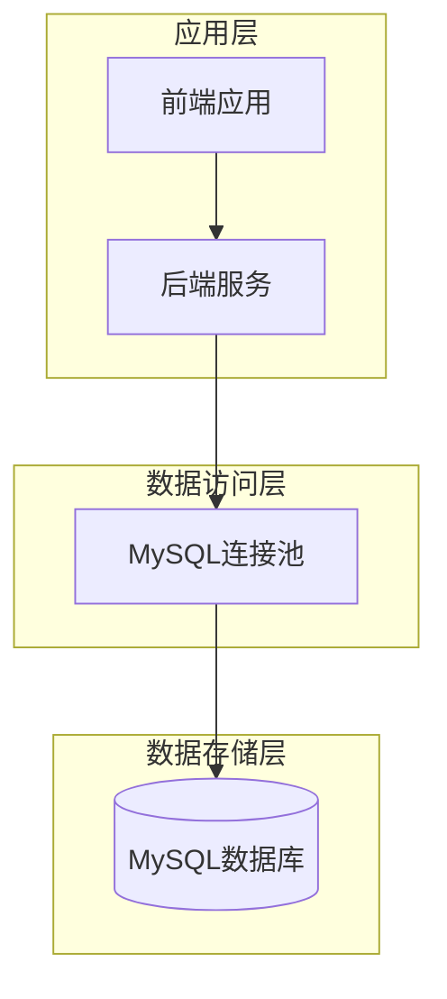
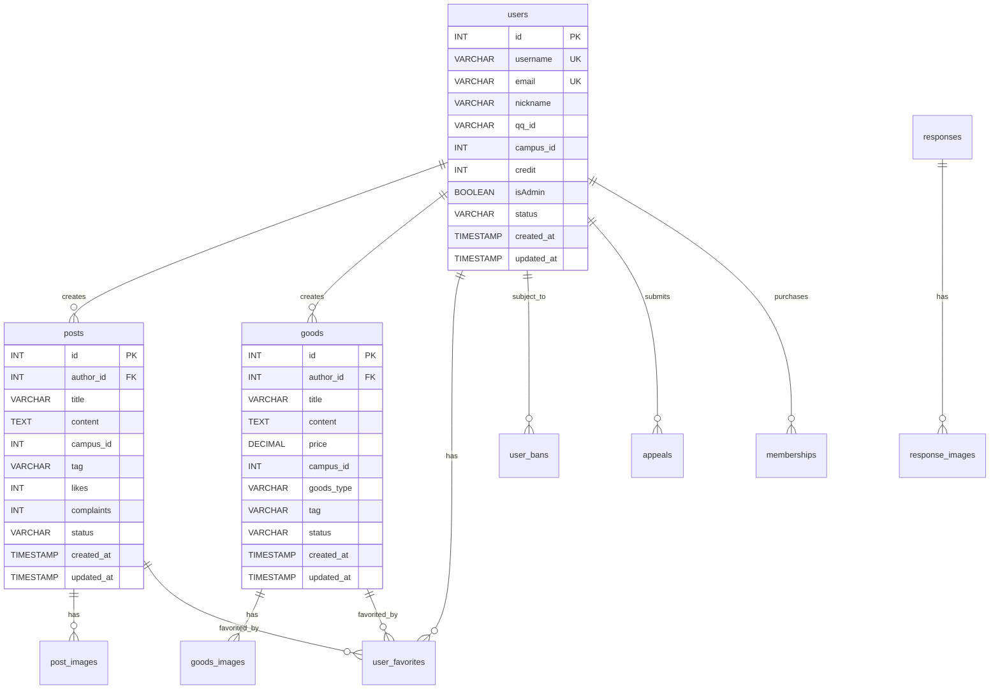

# 连理e站 数据库架构分析

## 数据库架构概览

### 数据库类型和版本
| 数据库 | 类型 | 版本 | 用途 | 部署方式 |
|--------|------|------|------|----------|
| MySQL | 关系型数据库 | 8.0+ | 主数据存储 | 单机部署 |

### 数据库架构图


## 表结构分析

### 核心业务表

#### 用户表 (users)
```sql
CREATE TABLE users (
    id INT PRIMARY KEY AUTO_INCREMENT,
    username VARCHAR(50) UNIQUE NOT NULL,
    email VARCHAR(100) UNIQUE NOT NULL,
    password_hash VARCHAR(255) NOT NULL,
    nickname VARCHAR(50) NOT NULL,
    qq_id VARCHAR(20),
    campus_id INT,
    credit INT DEFAULT 0,
    isAdmin BOOLEAN DEFAULT FALSE,
    status VARCHAR(20) DEFAULT 'active',
    created_at TIMESTAMP DEFAULT CURRENT_TIMESTAMP,
    updated_at TIMESTAMP DEFAULT CURRENT_TIMESTAMP ON UPDATE CURRENT_TIMESTAMP
);
```

#### 帖子表 (posts)
```sql
CREATE TABLE posts (
    id INT PRIMARY KEY AUTO_INCREMENT,
    author_id INT NOT NULL,
    title VARCHAR(200) NOT NULL,
    content TEXT,
    campus_id INT,
    tag VARCHAR(50),
    likes INT DEFAULT 0,
    complaints INT DEFAULT 0,
    status VARCHAR(20) DEFAULT 'active',
    created_at TIMESTAMP DEFAULT CURRENT_TIMESTAMP,
    updated_at TIMESTAMP DEFAULT CURRENT_TIMESTAMP ON UPDATE CURRENT_TIMESTAMP,
    FOREIGN KEY (author_id) REFERENCES users(id)
);
```

#### 商品表 (goods)
```sql
CREATE TABLE goods (
    id INT PRIMARY KEY AUTO_INCREMENT,
    author_id INT NOT NULL,
    title VARCHAR(200) NOT NULL,
    content TEXT,
    price DECIMAL(10,2),
    campus_id INT,
    goods_type VARCHAR(50),
    tag VARCHAR(50),
    status VARCHAR(20) DEFAULT 'active',
    created_at TIMESTAMP DEFAULT CURRENT_TIMESTAMP,
    updated_at TIMESTAMP DEFAULT CURRENT_TIMESTAMP ON UPDATE CURRENT_TIMESTAMP,
    FOREIGN KEY (author_id) REFERENCES users(id)
);
```

### 系统支撑表

#### 图片关联表
```sql
-- 帖子图片表
CREATE TABLE post_images (
    id INT PRIMARY KEY AUTO_INCREMENT,
    post_id INT NOT NULL,
    image_url VARCHAR(500) NOT NULL,
    created_at TIMESTAMP DEFAULT CURRENT_TIMESTAMP,
    FOREIGN KEY (post_id) REFERENCES posts(id)
);

-- 商品图片表
CREATE TABLE goods_images (
    id INT PRIMARY KEY AUTO_INCREMENT,
    goods_id INT NOT NULL,
    image_url VARCHAR(500) NOT NULL,
    created_at TIMESTAMP DEFAULT CURRENT_TIMESTAMP,
    FOREIGN KEY (goods_id) REFERENCES goods(id)
);

-- 回复图片表
CREATE TABLE response_images (
    id INT PRIMARY KEY AUTO_INCREMENT,
    responsel_id INT NOT NULL,
    image_url VARCHAR(500) NOT NULL,
    created_at TIMESTAMP DEFAULT CURRENT_TIMESTAMP
);
```

#### 用户交互表
```sql
-- 用户收藏表
CREATE TABLE user_favorites (
    id INT PRIMARY KEY AUTO_INCREMENT,
    user_id INT NOT NULL,
    post_id INT,
    goods_id INT,
    created_at TIMESTAMP DEFAULT CURRENT_TIMESTAMP,
    FOREIGN KEY (user_id) REFERENCES users(id),
    FOREIGN KEY (post_id) REFERENCES posts(id),
    FOREIGN KEY (goods_id) REFERENCES goods(id)
);

-- 用户封禁表
CREATE TABLE user_bans (
    id INT PRIMARY KEY AUTO_INCREMENT,
    user_id INT NOT NULL,
    reason TEXT,
    ban_until DATETIME,
    status VARCHAR(20) DEFAULT 'active',
    created_at TIMESTAMP DEFAULT CURRENT_TIMESTAMP,
    FOREIGN KEY (user_id) REFERENCES users(id)
);
```

#### 系统管理表
```sql
-- 广告表
CREATE TABLE advertisements (
    id INT PRIMARY KEY AUTO_INCREMENT,
    title VARCHAR(200) NOT NULL,
    content TEXT,
    image_url VARCHAR(500),
    link_url VARCHAR(500),
    start_date DATETIME,
    end_date DATETIME,
    clicks INT DEFAULT 0,
    status VARCHAR(20) DEFAULT 'active',
    created_at TIMESTAMP DEFAULT CURRENT_TIMESTAMP
);

-- 申诉表
CREATE TABLE appeals (
    id INT PRIMARY KEY AUTO_INCREMENT,
    author_id INT NOT NULL,
    related_id INT NOT NULL,
    title VARCHAR(200) NOT NULL,
    content TEXT,
    type VARCHAR(20),
    status VARCHAR(20) DEFAULT 'pending',
    created_at TIMESTAMP DEFAULT CURRENT_TIMESTAMP,
    FOREIGN KEY (author_id) REFERENCES users(id)
);

-- 回复表
CREATE TABLE responses (
    id INT PRIMARY KEY AUTO_INCREMENT,
    user_id INT NOT NULL,
    response_type VARCHAR(50),
    related_id INT,
    content TEXT,
    created_at TIMESTAMP DEFAULT CURRENT_TIMESTAMP
);

-- 会员表
CREATE TABLE memberships (
    id INT PRIMARY KEY AUTO_INCREMENT,
    uid INT NOT NULL,
    type VARCHAR(20),
    duration INT,
    created_at TIMESTAMP DEFAULT CURRENT_TIMESTAMP,
    FOREIGN KEY (uid) REFERENCES users(id)
);

-- 记录事件表
CREATE TABLE record_event (
    id INT PRIMARY KEY AUTO_INCREMENT,
    info VARCHAR(500),
    type VARCHAR(50),
    created_at TIMESTAMP DEFAULT CURRENT_TIMESTAMP
);
```

## 索引设计分析

### 索引类型总览
| 索引类型 | 用途 | 示例表 | 示例字段 |
|----------|------|--------|----------|
| 主键索引 | 唯一标识 | 所有表 | id |
| 唯一索引 | 唯一性约束 | users | username, email |
| 普通索引 | 查询优化 | posts | author_id, status, campus_id |
| 复合索引 | 多字段查询 | goods | author_id, status |
| 外键索引 | 关联查询 | 所有外键字段 | 外键字段 |

### 关键索引设计
```sql
-- 用户表索引
CREATE UNIQUE INDEX idx_users_username ON users(username);
CREATE UNIQUE INDEX idx_users_email ON users(email);
CREATE INDEX idx_users_campus ON users(campus_id);

-- 帖子表索引
CREATE INDEX idx_posts_author ON posts(author_id);
CREATE INDEX idx_posts_status ON posts(status);
CREATE INDEX idx_posts_campus ON posts(campus_id);
CREATE INDEX idx_posts_created ON posts(created_at);

-- 商品表索引
CREATE INDEX idx_goods_author ON goods(author_id);
CREATE INDEX idx_goods_status ON goods(status);
CREATE INDEX idx_goods_type ON goods(goods_type);

-- 收藏表索引
CREATE INDEX idx_favorites_user ON user_favorites(user_id);
CREATE INDEX idx_favorites_post ON user_favorites(post_id);
CREATE INDEX idx_favorites_goods ON user_favorites(goods_id);
```

## 关系模型分析

### 实体关系图


### 关系说明
- **一对多关系**: 
  - 用户和帖子 (1:N)
  - 用户和商品 (1:N)
  - 用户和收藏 (1:N)
  - 帖子和图片 (1:N)
  - 商品和图片 (1:N)

- **多对多关系**:
  - 用户通过收藏表与帖子/商品建立多对多关系

- **系统关系**:
  - 用户和封禁记录 (1:N)
  - 用户和申诉记录 (1:N)
  - 用户和会员记录 (1:N)

## 数据完整性分析

### 约束设计
| 约束类型 | 表名 | 约束字段 | 约束条件 |
|----------|------|----------|----------|
| PRIMARY KEY | 所有表 | id | NOT NULL, AUTO_INCREMENT |
| FOREIGN KEY | posts | author_id | REFERENCES users(id) |
| FOREIGN KEY | goods | author_id | REFERENCES users(id) |
| FOREIGN KEY | user_favorites | user_id | REFERENCES users(id) |
| FOREIGN KEY | user_favorites | post_id | REFERENCES posts(id) |
| FOREIGN KEY | user_favorites | goods_id | REFERENCES goods(id) |
| UNIQUE | users | username, email | UNIQUE |
| CHECK | users | status | IN ('active', 'inactive', 'suspended') |
| CHECK | posts | status | IN ('active', 'deleted') |
| CHECK | goods | status | IN ('active', 'deleted') |

### 触发器设计
```sql
-- 自动更新updated_at字段的触发器
DELIMITER //
CREATE TRIGGER update_users_updated_at 
BEFORE UPDATE ON users 
FOR EACH ROW 
BEGIN
    SET NEW.updated_at = CURRENT_TIMESTAMP;
END;//

CREATE TRIGGER update_posts_updated_at 
BEFORE UPDATE ON posts 
FOR EACH ROW 
BEGIN
    SET NEW.updated_at = CURRENT_TIMESTAMP;
END;//

CREATE TRIGGER update_goods_updated_at 
BEFORE UPDATE ON goods 
FOR EACH ROW 
BEGIN
    SET NEW.updated_at = CURRENT_TIMESTAMP;
END;//
DELIMITER ;
```

## 性能优化分析

### 查询优化策略
| 优化类型 | 优化策略 | 实现方式 |
|----------|----------|----------|
| 索引优化 | 合理创建索引 | B-tree索引、复合索引 |
| 查询优化 | 避免全表扫描 | 使用WHERE条件、索引覆盖 |
| 连接池优化 | 数据库连接池 | MySQL连接池配置 |
| 分页优化 | 大数据量分页 | LIMIT OFFSET优化 |

### 分区策略
当前系统数据量较小，暂未采用分区策略。随着数据增长，可考虑以下分区方案：
- **时间分区**: 日志类表按created_at字段按月分区
- **哈希分区**: 用户表按id字段哈希分区

### 缓存策略
| 缓存类型 | 缓存数据 | 过期时间 | 缓存策略 |
|----------|----------|----------|----------|
| 用户信息 | 用户基本资料 | 30分钟 | 主动刷新 |
| 配置信息 | 系统配置 | 1小时 | 定时刷新 |
| 热点数据 | 热门帖子/商品 | 15分钟 | LRU淘汰 |

## 数据安全分析

### 数据加密
| 数据类型 | 加密方式 | 加密算法 | 密钥管理 |
|----------|----------|----------|----------|
| 密码 | 哈希加密 | bcrypt | 单向哈希 |
| 敏感信息 | 应用层加密 | AES-256 | 环境变量 |
| 传输数据 | 传输加密 | HTTPS/TLS | 证书管理 |

### 访问控制
| 控制类型 | 控制策略 | 实现方式 | 控制粒度 |
|----------|----------|----------|----------|
| 数据库用户 | 最小权限原则 | 专用数据库用户 | 表级别 |
| 应用连接 | 连接池管理 | 连接字符串加密 | 应用级别 |
| 数据访问 | 业务逻辑控制 | JWT Token验证 | 行级别 |

### 备份策略
| 备份类型 | 备份频率 | 保留时间 | 备份方式 |
|----------|----------|----------|----------|
| 全量备份 | 每日 | 30天 | mysqldump |
| 增量备份 | 每小时 | 7天 | binlog |
| 逻辑备份 | 每周 | 90天 | 导出SQL |

## 监控和维护分析

### 监控指标
| 指标类型 | 指标名称 | 阈值 | 告警级别 |
|----------|----------|------|----------|
| 连接监控 | 活跃连接数 | >80% | 警告 |
| 性能监控 | 查询响应时间 | >1000ms | 警告 |
| 存储监控 | 磁盘使用率 | >85% | 警告 |
| 内存监控 | 缓存命中率 | <90% | 警告 |

### 维护策略
- **定期维护**: 每周进行数据库维护和优化
- **索引重建**: 定期重建碎片化严重的索引
- **统计信息更新**: 定期更新表统计信息
- **日志清理**: 定期清理过期日志和临时文件
- **性能调优**: 根据监控数据进行性能调优

## 总结

### 数据库架构特点
1. **关系型设计**: 采用MySQL关系型数据库，表结构设计规范，关系清晰
2. **模块化设计**: 按业务功能模块划分表结构，便于维护和扩展
3. **完整性保证**: 通过外键约束、唯一约束等保证数据完整性
4. **性能优化**: 合理的索引设计和查询优化策略
5. **安全防护**: 多层次的安全控制和数据加密机制
6. **可扩展性**: 支持水平扩展和垂直扩展的架构设计

### 改进建议
1. **引入Redis缓存**: 对于热点数据和会话信息，建议引入Redis缓存
2. **读写分离**: 随着用户量增长，可考虑主从复制和读写分离
3. **数据归档**: 对于历史数据，建立归档机制
4. **监控告警**: 完善数据库监控和自动告警机制
